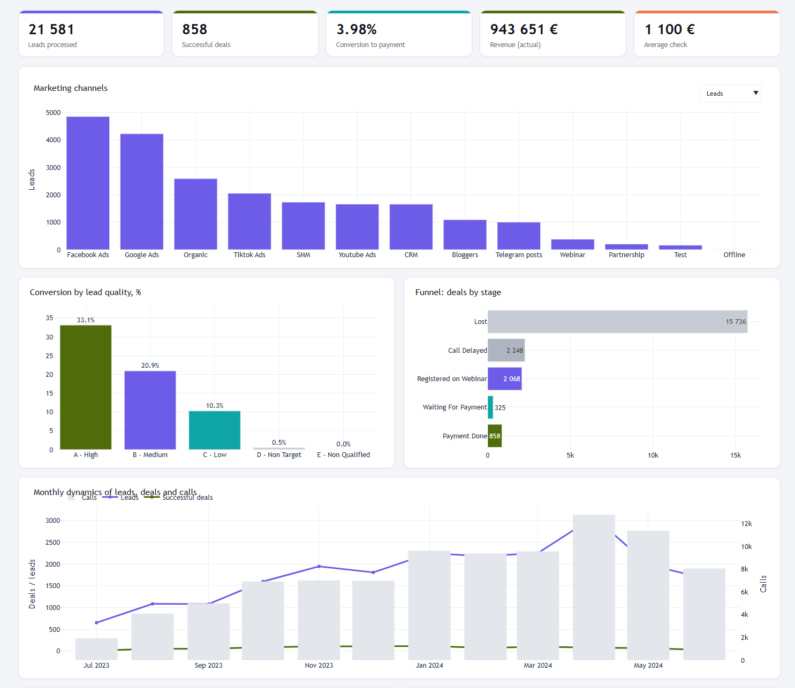

# CRM Sales Analytics Project

## Overview
This project analyzes CRM data from an online education company to identify opportunities for improving sales performance, marketing efficiency, and conversion rates.

The analysis includes data cleaning, exploratory data analysis, funnel analysis, marketing performance analysis, sales performance analysis, product analysis, business recommendations, and an interactive dashboard.

## Technologies
- Python
- Pandas
- NumPy
- SQL
- Power BI
- Tableau
- Plotly
- Jupyter Notebook
- Excel / Google Sheets

## Dataset
The CRM dataset consists of four tables:
- Deals
- Contacts
- Calls
- Marketing Spend

## Business Questions
The project answers the following questions:
- Which marketing channels generate the highest conversion?
- Which campaigns are the most effective?
- How efficient is the sales team?
- Which products perform best?
- Where are the main bottlenecks in the sales funnel?

## Project Files
- `Final_Project_Python_DA_EN.ipynb` — main Jupyter Notebook with analysis
- `Dashboard_CRM_Online_School_EN.html` — interactive dashboard
- `Presentation_Final_Project_Python_DA_EN.pptx` — final presentation

## Key Skills Demonstrated
- Data cleaning
- Exploratory data analysis
- Descriptive statistics
- Funnel analysis
- Conversion analysis
- KPI analysis
- Dashboard development
- Business recommendations

## Project Outcome
The project provides insights into sales performance, marketing efficiency, customer acquisition channels, and conversion bottlenecks. Based on the analysis, business recommendations were developed to improve decision-making and increase conversion efficiency.
